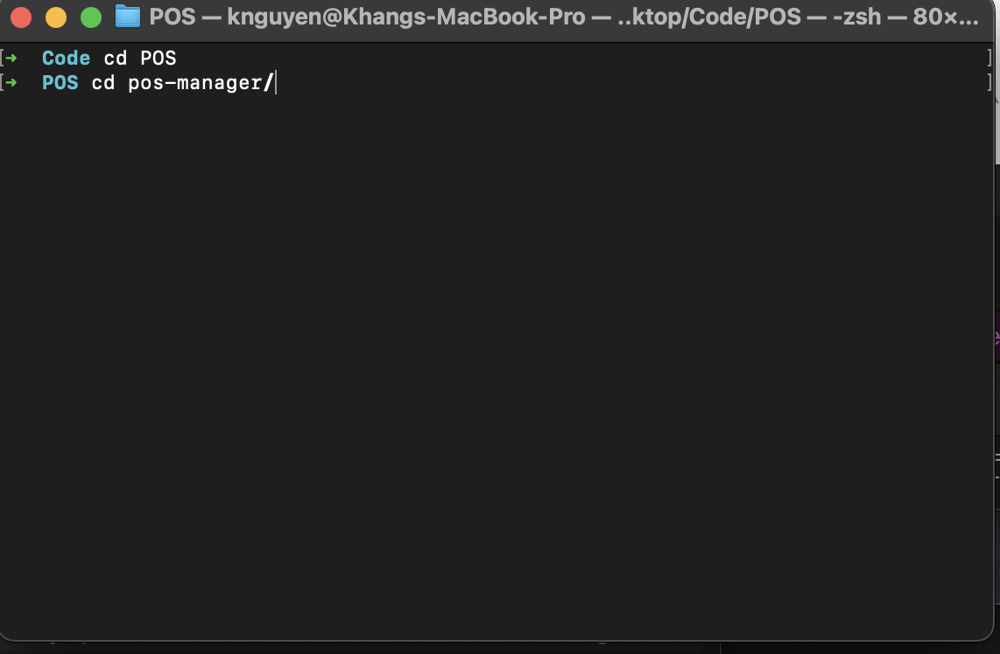

# Installation

### Repository's navigation

Navigate to your repository.

### Install packages

Depends you have `yarn` or `windows` then we run correct command either `yarn` or `npm i`

### Step 3: Verify when running `yarn start` or `npm start` will see the application running on `https://localhost:3000` correctly
