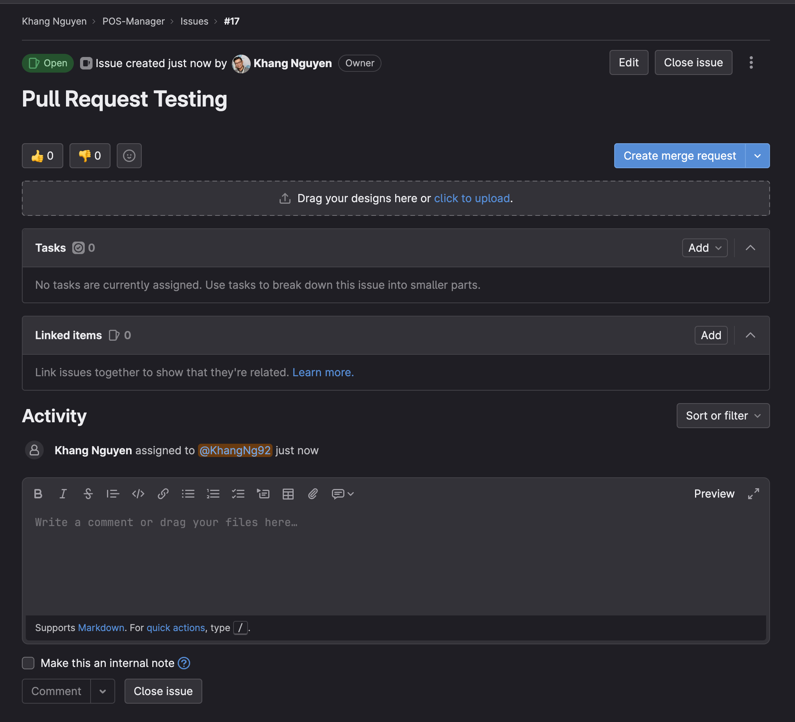
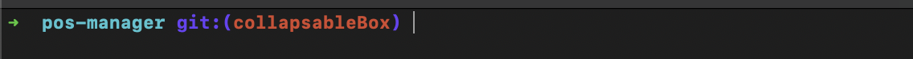
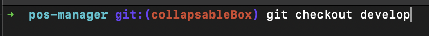
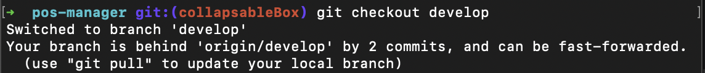

# Branch's Setup

## Terminal's recommendation

Before we start, let's take a look at these recommendations of terminals that I strongly suggest for you.

- For Windows: [Gitbash](https://git-scm.com/download/win), [Cmder](https://cmder.app/)
- For Mac: Regular terminal but install this [Oh My zsh](https://ohmyz.sh/)

## Creating your branch

- **Step 1**: let's grab one story from gitlab. In this case my task is `Pull Request Testing`



- **Step 2**: Let's make sure that you're in `develop` branch by confirming this in your terminal.



- **Step 3**: Oh no ! I'm in another branch. Let's switch to `develop` by typing in the following command

```bash
git checkout develop
```



- **Step 4**: This is also important. You always want to keep up-to-date with your `develop` branch. So in this case, I'm still behind with 2 commits from `origin`. I'll fix this by running the suggested command `git pull`



```bash
git pull
```

- **Step 5**: Now we're in a good stage for creating a new branch. Branch's naming rule is your branch name with dashes so in this case it's `pull-request-testing`

```bash
git checkout -b pull-request-testing
```

- **Step 6**: Tada, now you're good to code.

<!-- ## Update an existing version

It is possible to edit versioned docs in their respective folder:

- `versioned_docs/version-1.0/hello.md` updates `http://localhost:3000/docs/hello`
- `docs/hello.md` updates `http://localhost:3000/docs/next/hello` -->
